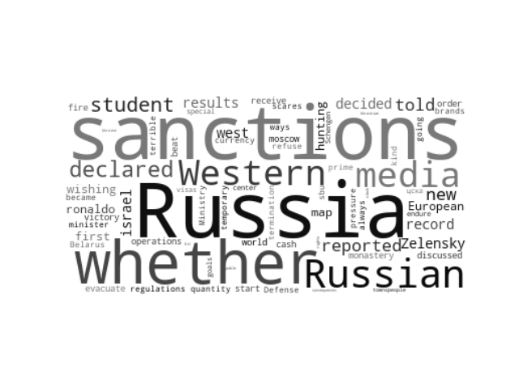
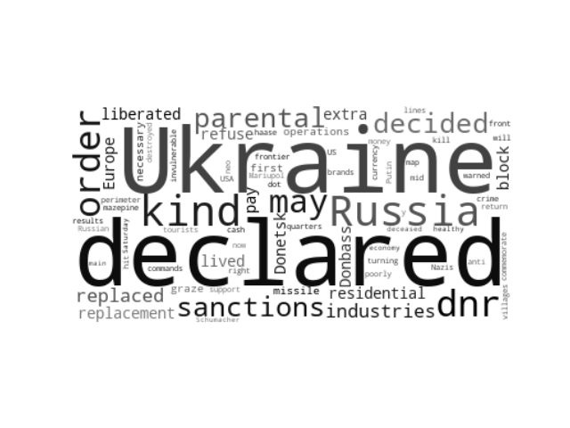
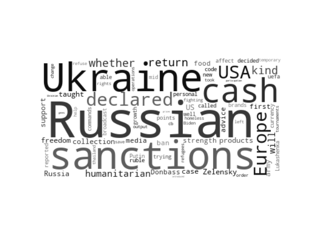
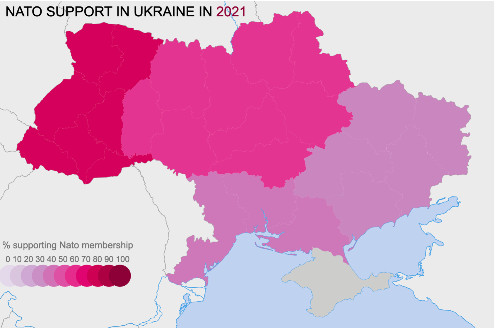
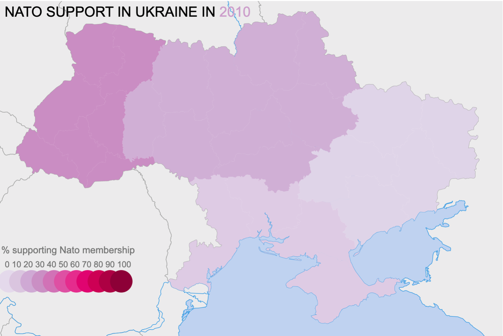
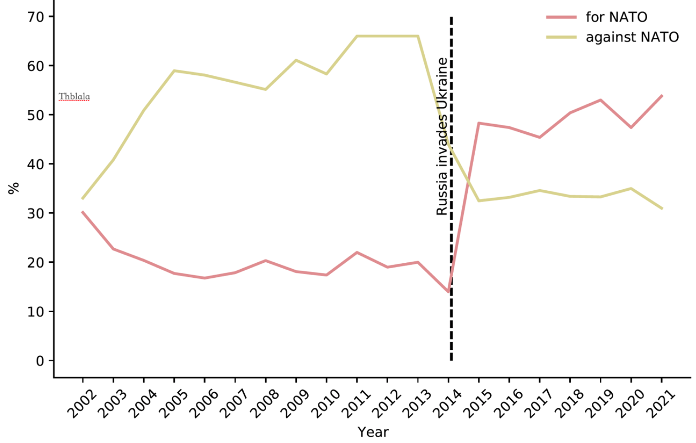
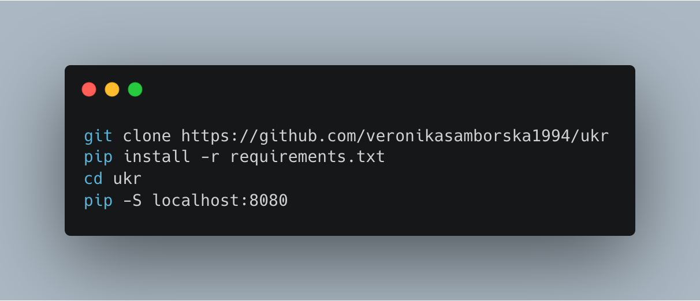

# GNI Fellowship (Financial Times) – Russian State Media Word Use and NATO sentiment in Ukraine

> This repository contains the code for the visualisation of the most frequent words used in articles on the main Russian state media website and NATO attitudes in Ukraine over time

## Summary
  

In 2014 when Russia first invaded Ukraine, it seemed much more unexpected than their most recent attempt, which started on the 24th of February 2022. However, if one examined Russian state media channels back then it was clear that Putin’s regime was preparing the Russian population for both the occupation of Crimea and for fighting so-called ‘facism’ in Eastern Ukraine.

This visualisation of the most frequently used words in one of the main Russian state media [websites](https://ria.ru/) uses Python to crawl the web page, extract titles of the articles, translate them using the Google translate Python package, and finally creates a plot with the font size representing relative frequency of the first fifty words used in the articles. 

In the last three days since I’ve created this script, almost no words related to war or invasion have appeared in the first fifty most frequently used words. Perhaps unsurprisingly, adjectives such as ‘liberated’ or ‘operations’ seem to have been used instead. The most common words relate to the reaction of the West in response to the Russian invasion of Ukraine. 

The next step will be to create visualisations of the words that are most commonly used together (e.g., ‘liberated Donetsk’). It can prove to be informative to monitor the Russian state media propaganda channels, as these have the potential to hint at Putin's intentions.

  

These visualisations are based on sociological [data](https://razumkov.org.ua/uploads/article/2021-nato-ukr.pdf) assessing the public opinion of Ukrainians regarding our country’s NATO membership over time. In 2002, only a third of the country supported Ukraine's membership in NATO, and a third opposed it. By 2014, the share of NATO supporters in Ukraine halved, and the share of opponents had doubled. Since 2014, in response to the Russian invasion of Crimea and Eastern Ukraine, there has been a dramatic increase in citizens' approval of Ukrainian membership in NATO.

There have always been regional differences in NATO membership approval, with western regions generally expressing stronger support. Even in 2021, NATO membership support was not supported by a majority in the Southern (33%) and Eastern (43%) regions of Ukraine. As the Russian military continues to primarily bombard the cities in Southern and Eastern areas (e.g., Mariupol and Kharkiv are some of the worst affected), it will be informative to see how NATO attitudes will change in these regions.

## Installation

